# Project 5

updating & upgrading ubuntu on client and server side

` $ sudo apt update`

` $ sudo apt upgrade`

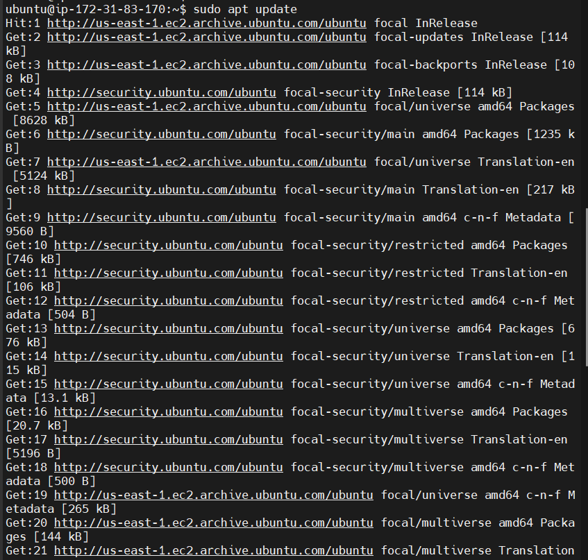

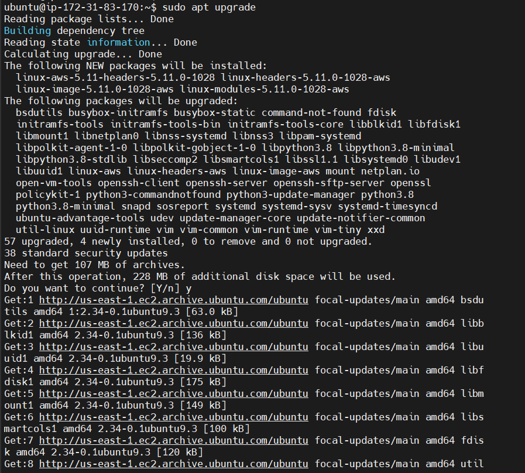

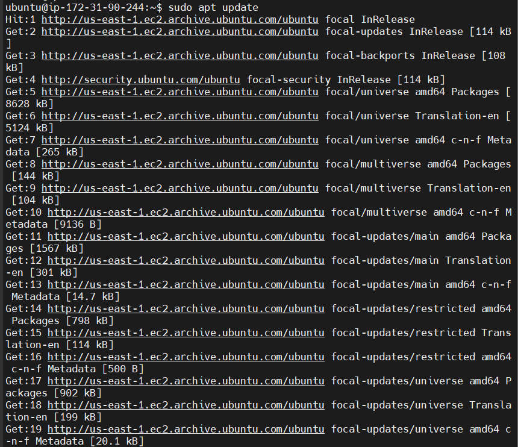

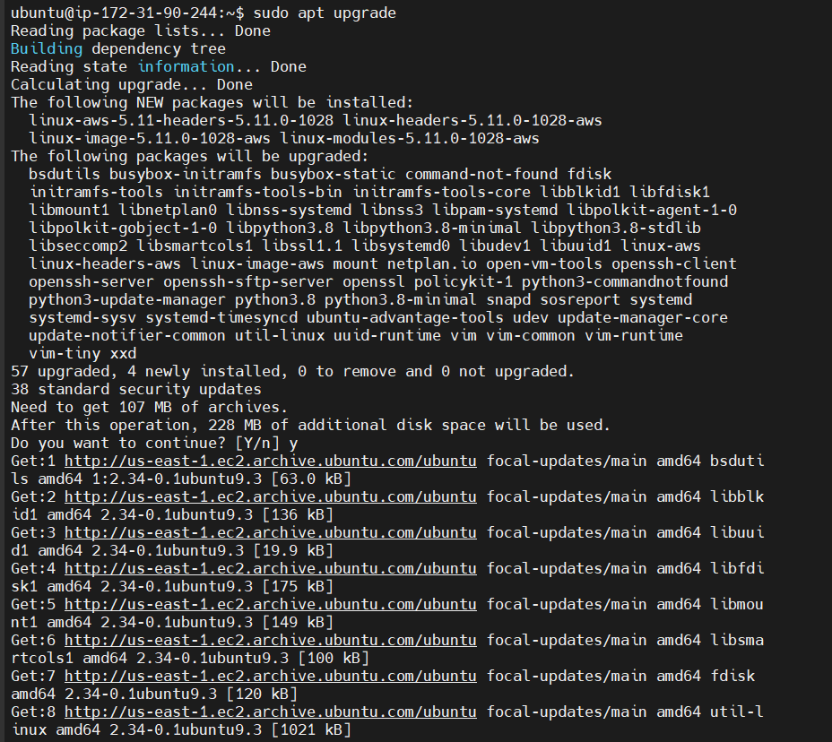

installing mysql server and mysql client respectively

` $ sudo apt install mysql-server`

` $ sudo systemctl enable mysql`

` $ sudo systemctl status mysql`

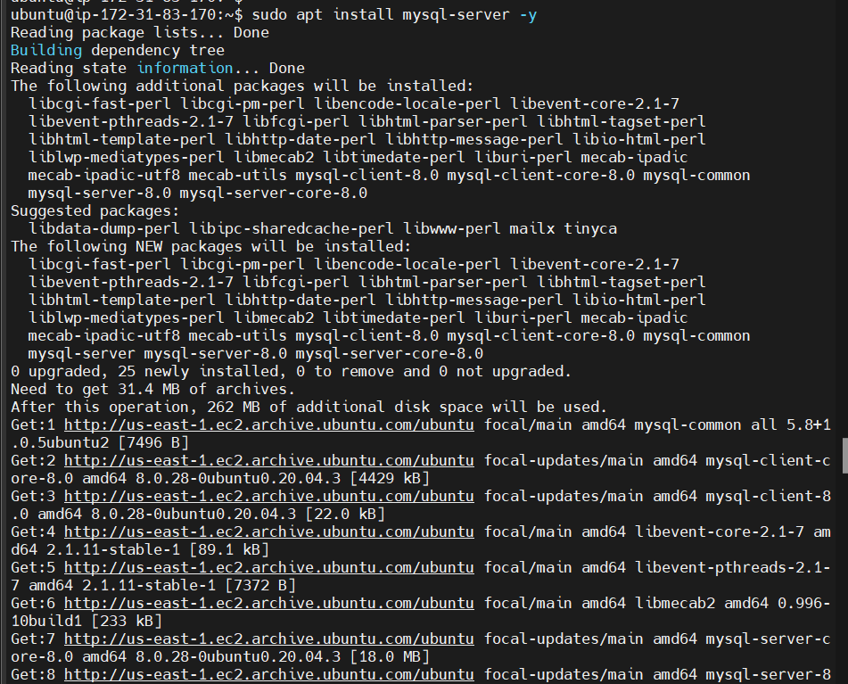

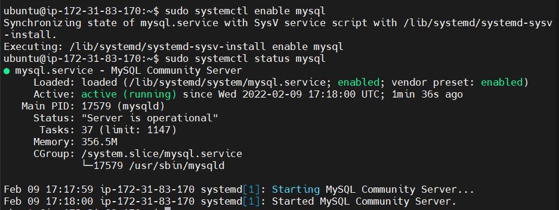

` $ sudo apt install mysql-client`

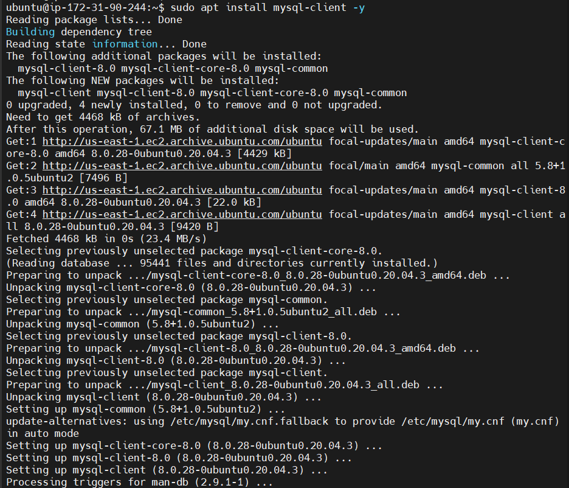

editing server's aws inbound rule to only allow client's ip

calling client's ip from terminal to include in inbound rule

` $ ip addr show`

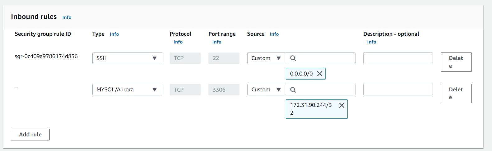

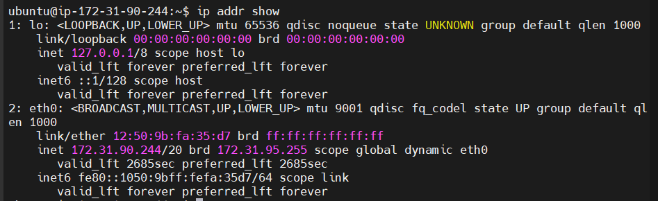

securing sql server and removing unwanted additions

` $ sudo mysql_secure_installation`

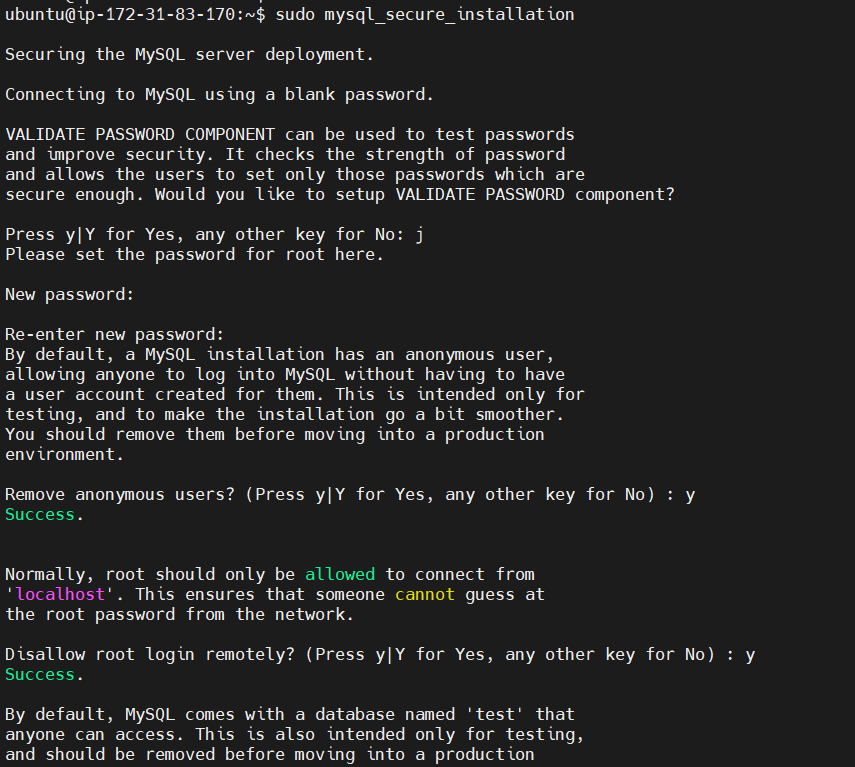

entering mysql server and populating it 

` $ sudo mysql`

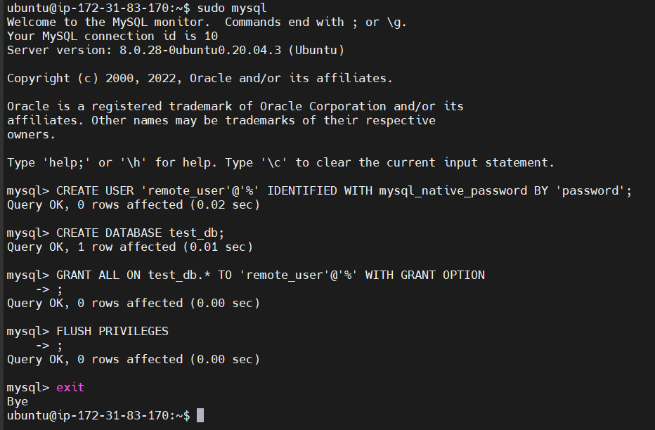

editing mysql bind-address configuration to allow access from any ip address

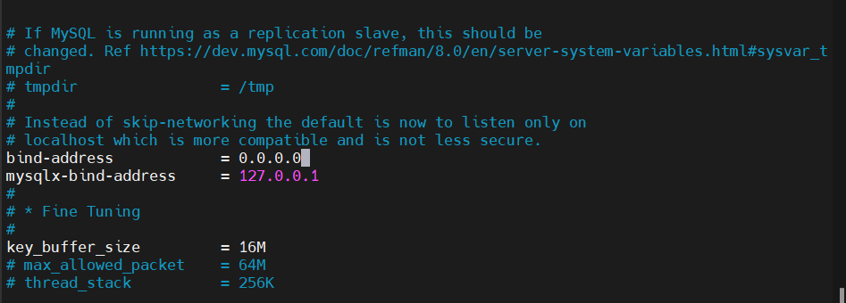

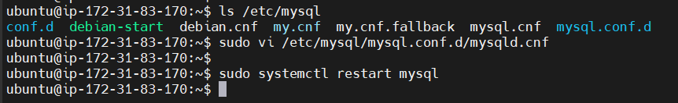

connecting to mysql server from client without ssh and confirming access to the database

` $ sudo mysql -u remote_user -h ipaddress -p`

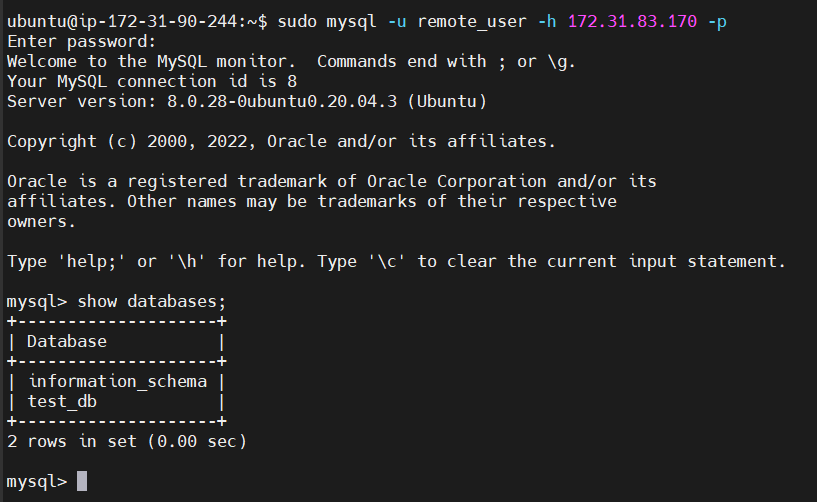